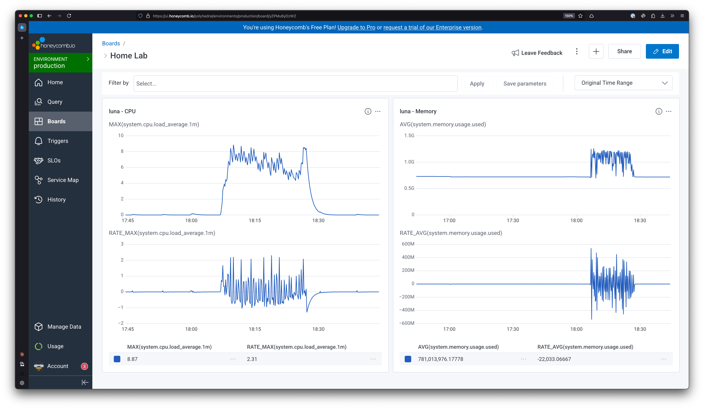

When I setup my homelab server (a post for another day), naturally I wanted a way to monitor it. If it was running out of memory, or if the CPU was getting taxed by some runaway process, I wanted to know about it. I've seen a [couple](https://www.youtube.com/watch?v=fzny5uUaAeY) [videos](https://www.youtube.com/watch?v=fXqTGzTKWEU) from [various](https://www.youtube.com/watch?v=F77y2wU30R0) creators on how to use tools like Prometheus, Grafana, Netdata, or Uptime Kuma to monitoring their homelab setups. But I wanted to take a different route.

At work, we use OpenTelemetry and Honeycomb to monitor the health of our systems. One goal for my homelab is to get more comfortable using devops and infrastructure tools, so familiarizing myself with the monitoring tools we use at work seemed like a perfect fit!

This post will walk you through how I set up my NixOS server to be monitored by an OpenTelemetry collector and send metrics to Honeycomb.

## Honeycomb

[Honeycomb](https://www.honeycomb.io/) is an observability platform that provides a unified data store and UI for querying telemetry data. It supports receiving data through [OpenTelemetry](https://opentelemetry.io/), an open source standard for metrics, logs, and traces. There are many observability platforms out there, and many of them now also support OpenTelemetry. The upside of OpenTelemetry is that you are free to switch between different platforms without needing to reimplement your instrumentation and metrics collection.

For my purposes, I chose Honeycomb, because it's a tool we also use at work; but any other platform which supports OpenTelemetry should work just as well with the rest of this setup.

To get started with Honeycomb, go to their [signup link](https://ui.honeycomb.io/signup) and create an account. You'll be guided through creating a team, and then creating an API key. Save your API key somewhere safe, as you will need it later.

## Secrets management with sops-nix

As I said in the intro, I am using [NixOS](https://nixos.org/) in my homelab. A full overview of NixOS is a post for another time, but the short version is that NixOS is a Linux distribution based on the Nix package manager and Nix configuration language. Nix is a _declarative_ language, which means that all configuration for the entire system is described in configuration files written in Nix.

In order to send metrics to Honeycomb, my NixOS system would need access to my Honeycomb API key. This meant I needed to figure out a way to securely incorporate the secret into my NixOS config. There are a few different projects out there that deal with secrets handling for NixOS systems, including [agenix](https://github.com/ryantm/agenix) and [sops-nix](https://github.com/Mic92/sops-nix). After reading the documentation for both of these, I decided to go with sops-nix, for one important feature.

Both agenix and sops-nix deploy the unencrypted secrets as files in the target system. But sops-nix also includes the capability to generate files using templates. This is particularly useful when a configuration file needs to contain a secret, such as our Honeycomb API key. The templates feature makes generating config files like these easy.

### Setting up sops-nix

First, I added sops-nix to my `flake.nix`:

```nix
{
  inputs = {
    sops-nix.url = "github:Mic92/sops-nix";
    sops-nix.inputs.nixpkgs.follows = "nixpkgs";
  };
}
```

Then I imported it in my default NixOS configuration:

```nix
{
  imports = [
    inputs.sops-nix.nixosModules.sops
  ];
}
```

### Generating age keys

sops-nix can use either age keys or GPG keys for encryption. I chose to use age, since it is simpler, and I'm not sharing this configuration with anyone.

To generate a new age key for my local macOS machine, I ran the following commands:

```
$ nix-shell -p age --run "age-keygen -o $HOME/Library/Application\ Support/sops/age/keys.txt"
```

This generated an age key in the default location for macOS. It prints out the corresponding public key before it exits.

I copied the public key and created a `.sops.yaml` file in my flake repo:

```yml
keys:
  - &charon <age public key>
creation_rules:
  - path_regex: secrets/[^/]+(\.(yaml|json|env|ini|conf))?$
    key_groups:
      - age:
          - *charon
```

The `creation_rules` section tells sops that it should expect secrets files in the `secrets/` directory, and these files should be encrypted using the listed `age` keys.

sops also needs to know the public key of any target systems where secrets will be deployed. The easiest way to generate these keys is by using the server's host key, which you can find with `ssh-keyscan`:

```
$ nix-shell -p ssh-to-age --run 'ssh-keyscan <server IP> | ssh-to-age'
```

I ran this with my server's IP and copied the public key into `.sops.yaml`, making sure to also add it to the list in `key_groups`.

### Encrypt secrets

To encrypt secrets, I used the `sops` command:

```
$ nix-shell -p sops --run "sops secrets/secrets.yaml"
```

This opened up my `$EDITOR` with a default template. I replaced the template with my secrets:

```yml
honeycomb_api_key: <Honeycomb API key>
```

Upon saving, `sops` encrypted the contents and wrote them to the file.

sops deploys secrets as files named after the YAML keys. In this case, a file in `/run/secrets` named `honeycomb_api_key` would be deployed containing the unencrypted secret. It's also possible to create subdirectories, by nesting the YAML keys.

### Deploying secrets

To deploy the secrets, I needed to reference them in my NixOS config. I made a new `secrets.nix` file and imported it into my main configuration. Its contents were simple:

```nix
{
  sops.defaultSopsFile = <path to secrets/secrets.yaml>;
  sops.age.sshKeyPaths = [ "/etc/ssh/ssh_host_ed25519_key" ];
  sops.secrets.honeycomb_api_key = {};
}
```

The first line tells sops where to find the `secrets.yaml` file. It's value is just the relative path from the current file.

The second line tells sops where to find the SSH private keys on the target machine to generate age keys. Since I was using my server's host key, I used the default path of the host key on the server.

The final line references the `honeycomb_api_key` secret. This ensures that the secret will be deployed with the configuration.

## OpenTelemetry Collector

The final part of this setup was actually generating the host metrics data. To do this, I decided to use the [OpenTelemetry Collector](https://docs.honeycomb.io/send-data/opentelemetry/collector/). The Collector is a vendor-agnostic tool which aggregates telemetry data from various sources and forwards it to another destination. Using it can be beneficial in many ways. For example, if you have a large number of services generating telemetry, you don't need to give each service API keys to send data to your data store; instead, they can send their data to the Collector, and the Collector can be the sole holder of the API keys and the connection to the data store.

The Collector is also able to generate metrics of its own if it is deployed as an agent on a host. These are called host metrics, because they are generated based on the system utilization of the host running the Collector. In my setup, I decided to run the Collector as an agent on my server, so I could use it to generate host metrics based on the server's utilization.

### Configuration in Nix

Enabling the Collector in Nix is easy:

```nix
{ pkgs, lib, config, ... }:
{
  services.opentelemetry-collector = {
    enable = true;
    package = pkgs.opentelemetry-collector-contrib;
  }
}
```

This enables the Collector as a systemd service on the server, and configures the service to use the `opentelemetry-collector-contrib` package. This package contains the host metrics generator, which we want.

### Config file template

The Collector configuration file needs to contain the Honeycomb API key, which we deployed through sops earlier. To inject it into the config file, we can use sops-nix's template feature.

I took Honeycomb's recommended host metrics configuration, and replaced the `x-honeycomb-team` value with a sops placeholder:

```nix
{ 
  sops.template."otel-collector-config.yaml".content = ''
  exporters:
    otlp:
      endpoint: api.honeycomb.io:443
      headers:
        x-honeycomb-team: "${config.sops.placeholder.honeycomb_api_key}"
        x-honeycomb-dataset: hostmetrics
  '';
}
```

The template feature creates a file in `/run/secrets` containing the template content, with placeholders replaced by the secret values. To make the Collector use this config, we have to give it the path:

```nix
services.opentelemetry-collector.configFile = config.sops.templates."otel-collector-config.yaml".path;
```

We also have to make sure that the Collector can read the file. For security, sops only allows specific users and groups to read secret files. We can create a service user and group for the Collector to run as:

```nix
{ 
  users.users.otelcol = {
    description = "OpenTelemetry Collector";
    group = "otelcol";
    isSystemUser = true;
  };
  users.groups.otelcol = {};
}
```

And then make sure that the config file is owned by that user:

```nix
{ 
  sops.templates."otel-collector-config.yaml".owner = config.users.users.otelcol.name;
  sops.templates."otel-collector-config.yaml".group = config.users.users.otelcol.group;
}
```

NixOS runs the Collector as a systemd service, by default with a dynamic user. This means that systemd will generate a dynamic user and group for the service when it starts. We can override this behavior by simply overriding the service definition:

```nix
{ 
  systemd.services.opentelemetry-collector = {
    serviceConfig = {
      DynamicUser = lib.mkForce false;
      User = config.users.users.otelcol.name;
      Group = config.users.users.otelcol.group;
    };
  };
}
```

## Deploying

With the config sorted out, I rebuilt my configuration, and almost instantly, I could see metrics flowing into Honeycomb!

I created some basic dashboards to monitor the health of my server:



The spike here was due to Plex scanning an detecting intros/credits on some new media. Neat!

Honeycomb's free tier provides 20M events per month. After running this for about 24 hours, I have generated about 7,000 events' worth of metrics. That should put me well under the monthly limit, with plenty of room to add more hosts, or application tracing in the future.
